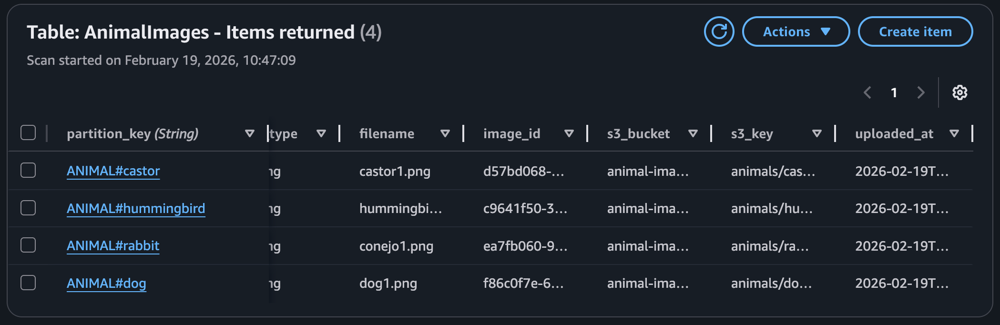
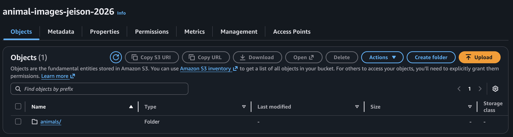

# ANIMAL IMAGE INTERACTION WITH DYNAMO DB AND S3 + STREAMS + LAMBDA
<div align="center" style="display: flex; justify-content: center; gap: 10px;">
  
  
  
</div>

---
Developed by Jeison Robles Arias</br>
[Lets Connect on LinkedIn](https://www.linkedin.com/in/jeison-robles-arias-6ab8a9ba/?locale=en-US)</br>
[Medium](https://medium.com/@roblesjeison)
</br></br>

---

## About this repo:

This repo responds to the AWS Data Engineering Cert i'm preparing for.

Along this repo I built a simple interaction within vscode + aws (IAM+DynamoDB+S3+Streams+Lambda). Here I apply important practices like IAM least privilege principle, Partition Key + Sort Key, Quering instead of Scanning, batching and so on and so foth.

On customer site I explored boto3 SDK and important features it has when connecting Amazon Web Services.

---
## Learning Goals

-  🔐 IAM authentication (Access Keys + Credential Provider Chain)
- 🧩 DynamoDB data modeling (Partition Key + Sort Key)
- ⚡ Query vs GetItem
- 🗑 Amazon  Simple Storage S3 Bucket 
- 🐍 boto3 SDK structure (client vs resource)

---
## Structure
The next is the  detail  of the followed process:
```
                Local Machine (VSCode)
                          |
                ----------------------
                |      boto3 SDK     |
                ▼                    ▼
          AWS DynamoDB           AMAZON S3
                |
                ▼
          Dynamo Streams
                |
                ▼
          Lambda Function
                |
                ▼
          CloudWatch Logs
```

---
## Project Structure

```
ANIMAL-IMAGE-INTERACTION/
|
|--img/
|--src/
|    |--aws_clients.py
|    |--delete_image.py
|    |--download_image.py
|    |--list_images.py
|    |--upload_image.py
|--LICENSE
|__README.md
```

## DYNAMO DB TABLE
This table was created to keep track of all the metadata of images being stored in S3:

**Table Name:** `CustomerProducts`

| Attribute     | Type   | Key Type                  |
|---------------|--------|---------------------------|
| partition_key | String | Partition Key (HASH)      |
| sort_key      | String | Sort Key (RANGE)          |
| animal        | String | Data                      |
| content_type  | String | Data                      |
| file_name     | String | Data                      |
| image_id      | String | Data                      |
| s3_bucket     | String | Data                      |
| S3_key        | String | Data                      |
| uploaded_at   | String | Data                      |

Table on DynamoDB


---
## Amazon Simple Storage

A bucket was created for the project, here were saved all the images and its respective addresses and info was saved on the NoSQL DB:



---
# Using capabilities

Now are given a couple of examples about the use of the project, basically we can:
- Upload an image
- List images of a given animal (if exists)
- Delete some image based on its ID

Next are some examples:

#### Uploading:

Command: ANIMAL-IMAGE-INTERACTION % python src/upload_image.py --file ~/Downloads/hummingbird.png --animal hummingbird 

Output:
Uploaded successfully:
{'partition_key': 'ANIMAL#hummingbird', 'sort_key': 'IMG#2026-02-19T16:31:30.970876Z#c9641f50-3b86-4a30-bd12-0fe079df50f5', 'image_id': 'c9641f50-3b86-4a30-bd12-0fe079df50f5', 'animal': 'hummingbird', 's3_bucket': 'animal-images-jeison-2026', 's3_key': 'animals/hummingbird/2026-02-19/c9641f50-3b86-4a30-bd12-0fe079df50f5-hummingbird.png', 'filename': 'hummingbird.png', 'content_type': 'image/png', 'uploaded_at': '2026-02-19T16:31:30.970876Z'}

#### Listing Images:

Command: ANIMAL-IMAGE-INTERACTION % python src/list_images.py --animal dog

Output: 
1)
  Animal: dog
  Image ID: f86c0f7e-61b5-4664-af82-1d439bd26d17
  Uploaded At: 2026-02-19T03:48:23.214146Z
  S3 Key: animals/dog/2026-02-19/f86c0f7e-61b5-4664-af82-1d439bd26d17-dog1.png

#### Deleting Images:

Command: 
python src/delete_images.py --animal cat --uploaded_at 2026-02-19T03:51:50.056720Z --image_id d4ad3ba5-4a07-49d3-bddc-ed292c164c73

Output:
Delete OK: {'deleted': True, 's3_bucket': 'animal-images-jeison-2026', 's3_key': 'animals/cat/2026-02-19/d4ad3ba5-4a07-49d3-bddc-ed292c164c73-cat.png'}

---
# Streaming with CloudWatch Log
Next are two examples of how looks like the streamed events happened on DynamoDB

#### Insert:


#### Delete


